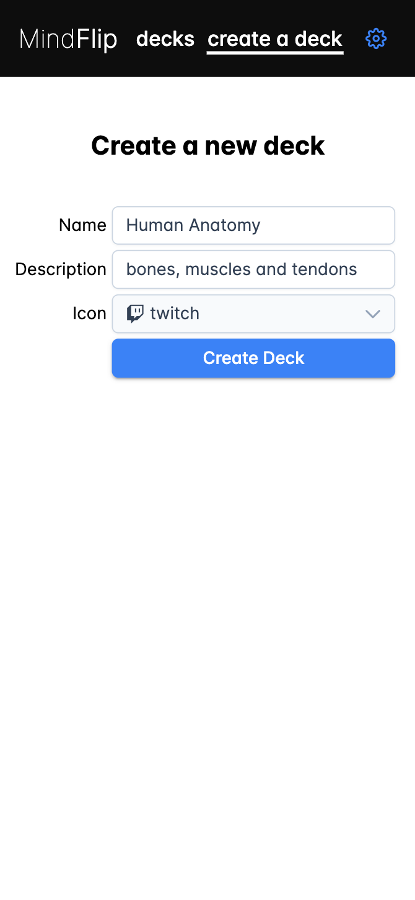
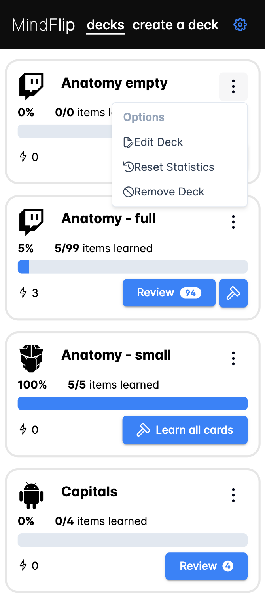
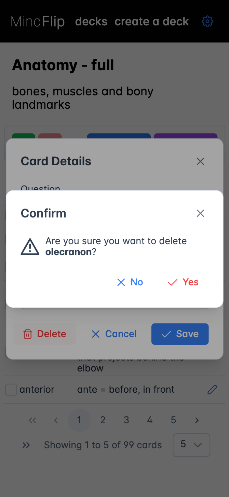
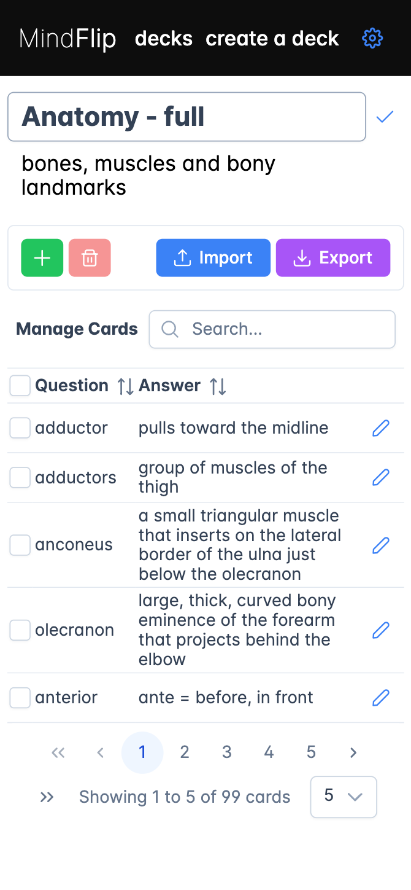
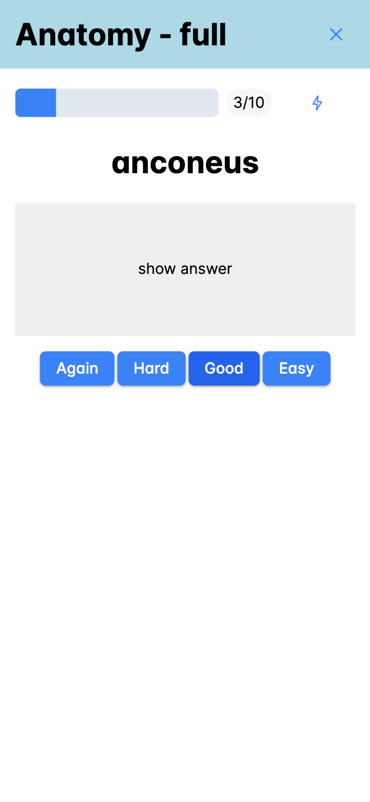
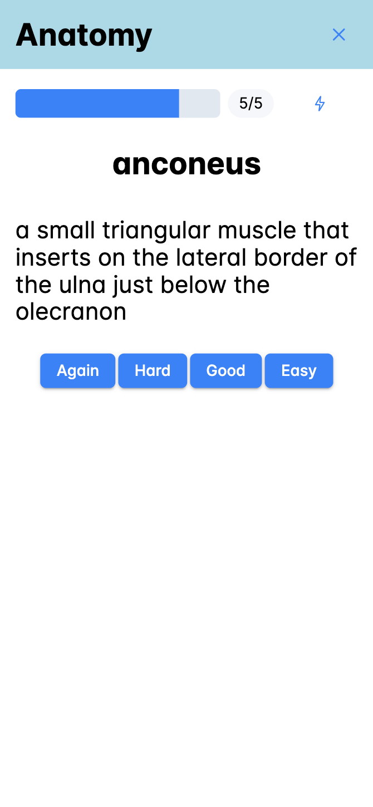
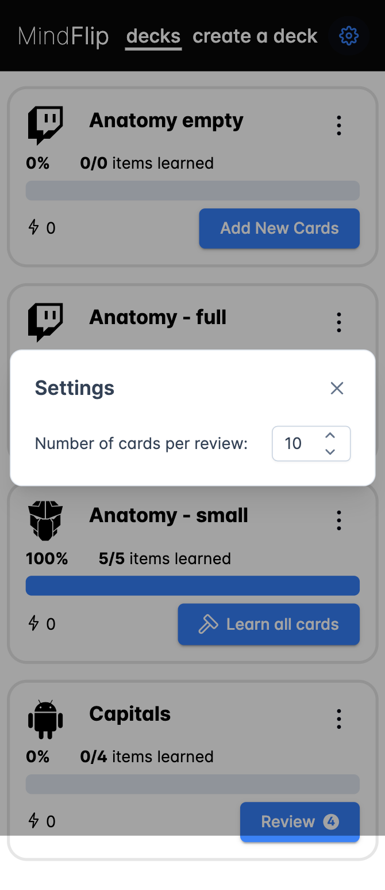

[](https://github.com/viliusddd/mindflip/actions/workflows/deploy.yaml)

# MindFlip


Level up your brain game with flashcards, powered by the snazzy new FSRS algorithm. Create, sort, and cram your way to genius status with minimal fuss. Simple, sleek, and distraction-free, it's all about mastering the must-knows and supercharging your smarts with zero hassle.

- [MindFlip](#mindflip)
  - [Quick Start](#quick-start)
  - [Main Features](#main-features)
  - [Tech Stack](#tech-stack)
  - [Screenshots](#screenshots)
  - [Project Setup](#project-setup)

## Quick Start

1. Create a new deck going to `create a deck`, fill all fields and press `Create Deck`
2. In the newly opened page - press `Import` and import one of the `.CSV` files from the project `examples` directory. It will populate current deck with data.
3. To start reviewing flashcards - go back to `decks` and press `Review` on your deck.

## Main Features

- Add/remove/edit decks and cards;
- Import/export **\*.CSV** with cards data;
- Responsive;
- Uses [FSRS](https://github.com/open-spaced-repetition/ts-fsrs#about-the) (free spaced repetition scheduler) algorithm.

## Tech Stack

[](https://vuejs.org/)
[](https://www.typescriptlang.org/)
[](https://vitejs.dev/)
[](https://vitest.dev/)
[](https://playwright.dev/)

## Screenshots

<details open>
    <summary>page responsivness</summary>
    
</details>

<details>
    <summary>create new deck page</summary>
    
</details>

<details>
    <summary>deck options menu</summary>
    
</details>

<details>
    <summary>decks</summary>
    
</details>

<details>
    <summary>confirmations</summary>
    
</details>

<details>
    <summary>edit card details</summary>
    
</details>

<details>
    <summary>edit deck title or description</summary>
    
</details>

<details>
    <summary>review card covered</summary>
    
</details>

<details>
    <summary>review card uncovered</summary>
    
</details>

<details>
    <summary>general settings</summary>
    
</details>

## Project Setup

1. Clone the repository locally and navigate to it:
   ```sh
   git clone git@github.com:viliusddd/mindflip && cd mindflip
   ```
2. Install the required packages:

   ```sh
   npm install
   ```

3. Compile and Hot-Reload for Development:

   ```sh
   npm run dev
   ```

4. You are ready to go!
