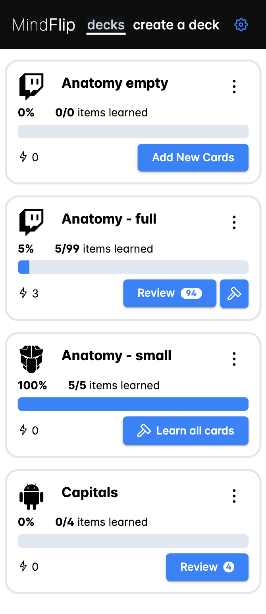

[](https://github.com/viliusddd/mindflip/actions/workflows/deploy.yaml)

# MindFlip



Streamline your learning with our text-only flashcards app. Effortlessly create, organize, and study with simple, distraction-free cards. Perfect for focusing on the essentials and boosting your knowledge efficiently.

## Quick Start

1. Create a new deck going to `create a deck`, fill all fields and press `Create Deck`
2. In the newly opened page - press `Import` and import one of the `.CSV` files from the project `examples` directory. It will populate current deck with data.
3. To start reviewing flashcards - go back to `decks` and press `Review` on your deck.
> Optionally check-out `screenshots/` on repo for quick preview of the app.
## Project Setup

```sh
npm install
```

### Compile and Hot-Reload for Development

```sh
npm run dev
```

### Type-Check, Compile and Minify for Production

```sh
npm run build
```

### Run Unit Tests with [Vitest](https://vitest.dev/)

```sh
npm run test:unit
```

### Run End-to-End Tests with [Playwright](https://playwright.dev)

```sh
# Install browsers for the first run
npx playwright install

# When testing on CI, must build the project first
npm run build

# Runs the end-to-end tests
npm run test:e2e
```

### Lint with [ESLint](https://eslint.org/)

```sh
npm run lint
```
